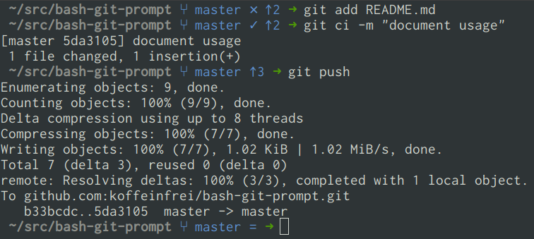

# Bash prompt

Clean and minimal bash prompt written in pure bash script.



This script depends on the [Git prompt for
bash](https://github.com/koffeinfrei/bash-git-prompt)

## Usage

1. Download the script
   ```bash
   curl https://raw.githubusercontent.com/koffeinfrei/bash-prompt/master/bash-prompt > ~/.bash-prompt
   ```

1. Download the git script
   ```bash
   curl https://raw.githubusercontent.com/koffeinfrei/bash-git-prompt/master/bash-git-prompt > ~/.bash-git-prompt
   ```

1. Add the following to your `.bash_profile` (or `.bashrc` or whatever bash
   initialize script you use):
   ```bash
   # 1. Exposes the function `set_bash_prompt`
   source ~/.bash-prompt

   # 2a. Call the script
   set_bash_prompt

   # 2b. Call the script with chroot information (example for debian)
   set_bash_prompt $debian_chroot
   ```

Alternatively, if you're using some sort of dotfiles, you can add this
repository as a submodule to your dotfiles and source the script directly.
[This is how I do
it](https://github.com/koffeinfrei/dotfiles/blob/cdb8125b591d5e22c4f4457374fc83c482347c87/.bash_profile#L53-L54)

## What it does

1. Shows the current directory (with chroot support)
1. Shows the git status
1. Uses some nice colors
1. Does not show any additional clutter as the user- and hostname. That's
   information that I don't need on the terminal. It just wastes screen space.
